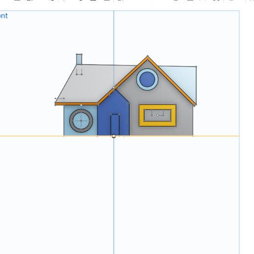

<section id="one">
	

		<header class="major">
			<h1>3DPC Gallery</h1>
		</header>

<h3>Architectural Design: "???" by Aiden</h3>

	

		

		
<h5>Architectural Design: Lily</h5>

		

		

		
<h5>-</h5>

		

		

		
<h5>-</h5>

		

		<!-- Break -->
		

		

		

		<!-- Break -->
		

		

		

	

